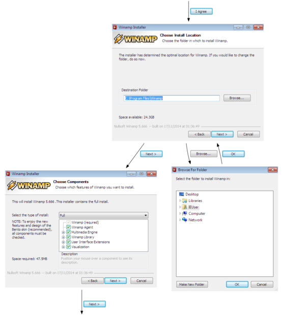

Mr. Murphy
==========

Mr. Murphy is a framework for automating Graphical User Interface (GUI) based application analysis and testing.

Mr. Murphy enables the automation of simple tasks such as setting up known applications as well as more complex ones like driving generic installers or exploring unknown applications.

Mr. Murphy aims to be platform agnostic in regards of the device and Operating System used to execute the application as well as its GUI framework.

Audience
--------

This framework is intended for developers and testers which want to perform in-depth analysis of GUI based applications.

Mr. Murphy provides APIs for the abstraction of the GUI state and the available interactions altogether with a journal of the already visited states.
The User can combine the current state with the prior knowledge to write smart agents able to perform tasks requiring complex user interactions.

The exploration steps can be easily rendered as a HTML page. The resulting visual representation of the GUI application is a useful tool for analysing the software usability, to identify bugs and issues or for exploring an unknown application.

Getting Started
---------------

Althought Mr. Murphy platform support can be easily extended, so far it is limited to `libvirt`_ supported virtualization technologies.

TODO: To set up a test environment, read the related chapter in the documentation.

Requirements
++++++++++++

 * Python > 3.5
 * A virtualization capable host
 * Libvirt and a supported hypervisor driver

Installing
----------

MrMurphy is available on PyPi.

.. code:: bash

   $ pip install mrmurphy

A command line tool allowing to run few examples is available.

.. code:: bash

   $ mrmurphy --help

Running the tests
-----------------

Tests can be executed using either `nosetest` or `pytest`.

.. code:: bash

   $ pytest test/

Contributing
------------

Please read CONTRIBUTING.md for details regarding the code of conduct, and the process for submitting pull requests.

License
-------

This project is licensed under the Apache License Version 2.0 - see the LICENSE.txt file for details

Acknowledgments
---------------

TODO

.. _libvirt: https://libvirt.org/
