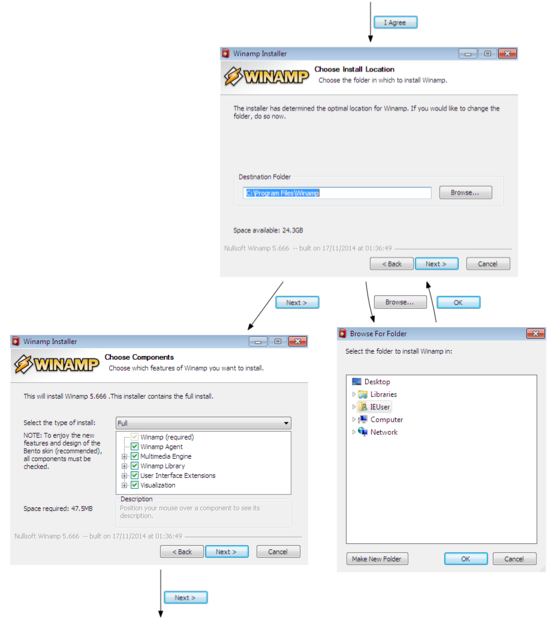
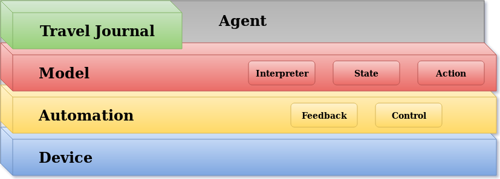

.. mrmurphy documentation master file, created by
   sphinx-quickstart on Wed Feb 21 15:58:47 2018.
   You can adapt this file completely to your liking, but it should at least
   contain the root `toctree` directive.

Mr. Murphy
==========

Framework for automating Graphical User Interface (GUI) based application analysis and testing.

Rationale
---------

Most of the available UI automation frameworks are built on the assumption the application to automate and the steps to perform are well known.

Mr. Murphy was originally built to explore complex GUI applications in order to find issues which other testing approaches could not.
As it proved quite successful, it was soon tested against other use cases such as the automation of generic Windows installers as well as analysis of Potentially Unwanted Applications (PUA).

Though Mr. Murphy has a limited support for platforms and GUIs, its APIs were designed to enable easy extension of the framework.

Design Principles
-----------------

Mr. Murphy borrows several concepts and design patterns from basic Automation and State/Model representation principles.

The problem abstraction is divided in different layers which are here represented.

At the lowest layer, the Device can be either a physical computer, a mobile device or a virtual machine. The configuration, provisioning and operation of the Device are out of Mr. Murphy scope.

The Automation layer is the first abstraction implemented by the framework. Its responsibility is to enable the interfacing with the chosen Device.
The Automation facilities allow to acquire raw data such as screenshots and control the Device interfaces such as mouse and keyboard.
This layer can be extended to provide support to new platforms such as hardware devices or hypervisors.

The Model layer is responsible for interpreting the GUI state and providing a formal representation of it.
A State consists of static information such as the window image and actionable items leading to the transition to a new State.
This layer abstracts Operating Systems and windowing frameworks details.

The Travel Journal layer allows to annotate the State transitions and represent them as a directed graph. As the application under test might be unknown or presenting unexpected variations, the Journal becomes a useful support for the exploration process.

The last layer, the Agent, drives the execution of the GUI application. It does so by interpreting the application GUI State and comparing it with the information stored in the Journal.
Agents implementations are Use Case specific. Few examples are available in the `agents` folder and can be used via the command line tool.

.. code:: bash

   $ mrmurphy --help

Resources
---------

.. toctree::
   :maxdepth: 2

   setup
   agent_development

Interfaces & API documentation
------------------------------

.. toctree::
   :maxdepth: 2

   mrmurphy

Indices and tables
==================

* :ref:`genindex`
* :ref:`modindex`
* :ref:`search`
